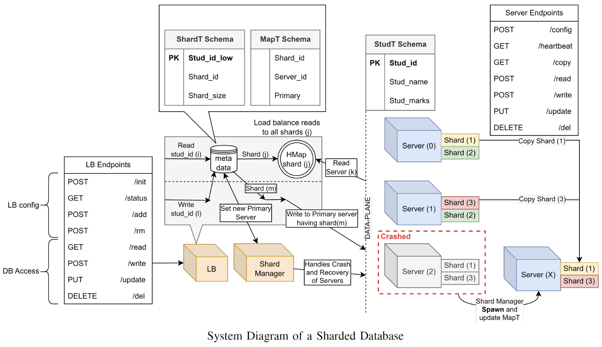
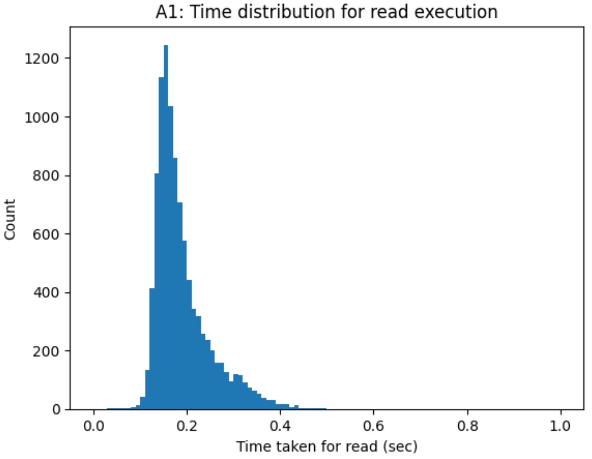
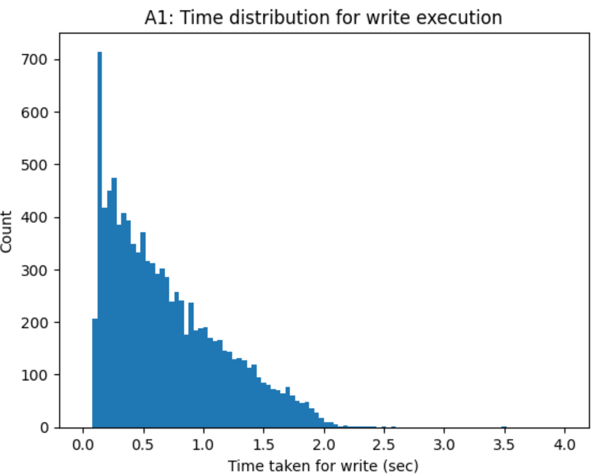
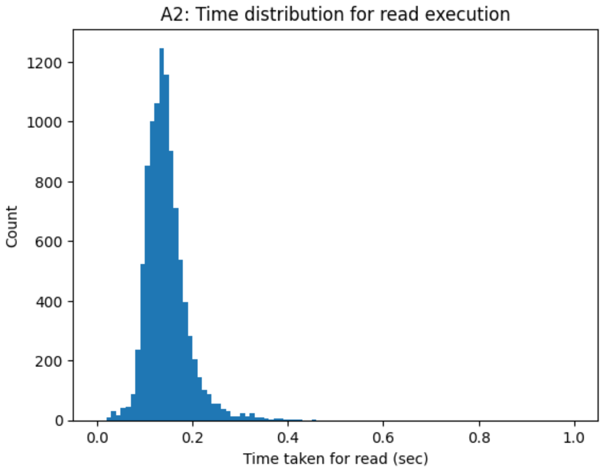
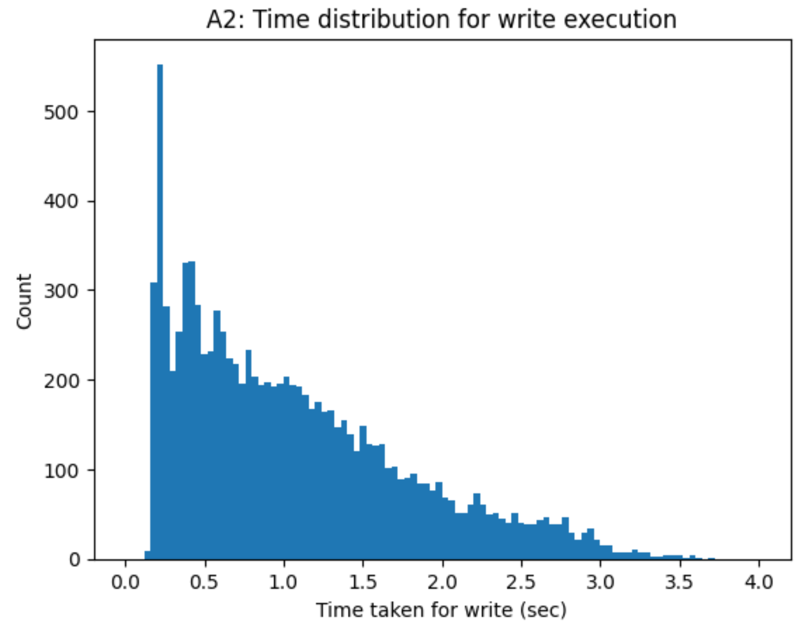
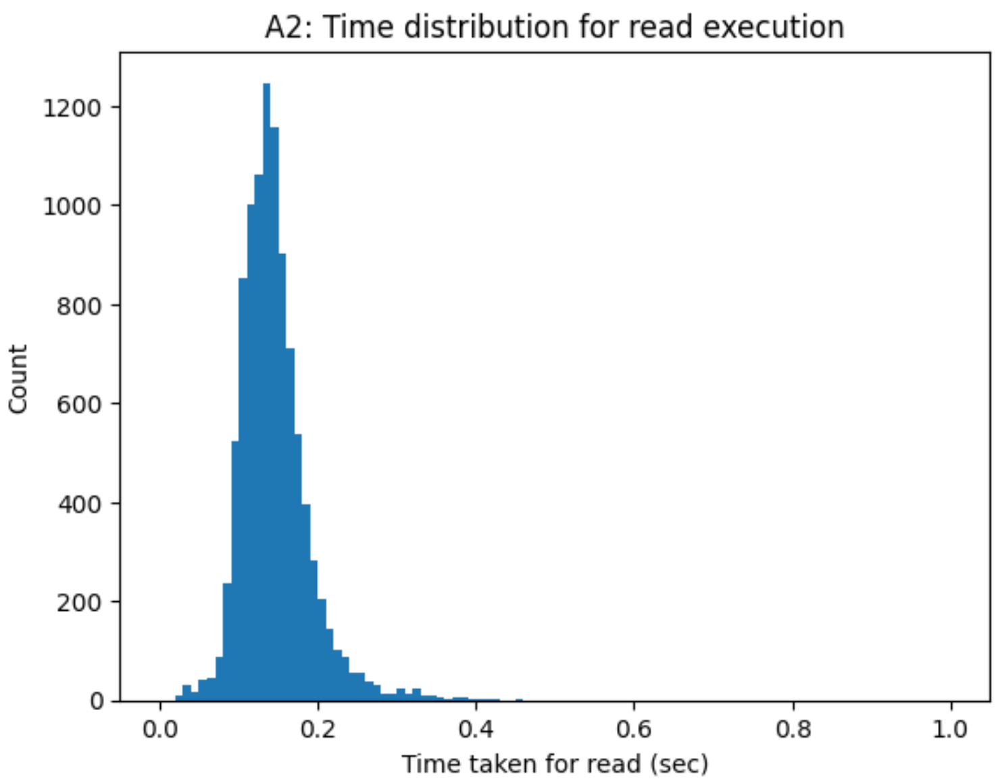
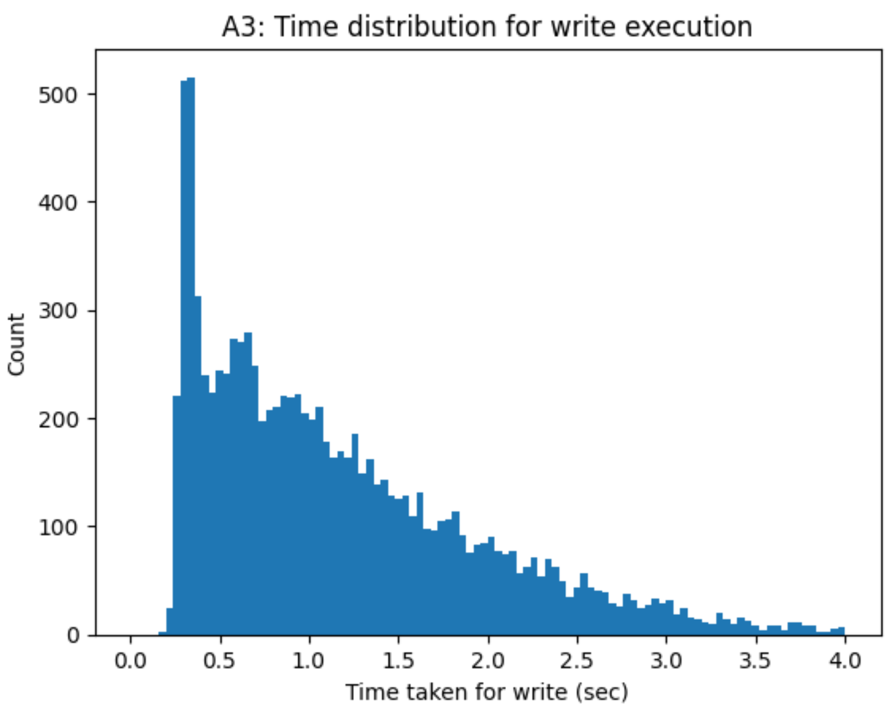

# CS60002: Distributed Systems (Spring 2024)

## System Design


The repository implements a distributed load balancer with sharding in Python programming language using Flask for handling HTTP requests to interact with it over the network. Our architecture uses four classes namely ServerMap, Server, ShardMap and Shard to handle all the incoming requests and hold metadata.

<ol>
<li>ServerMap: ServerMap is a singleton class that maps server IDs to the corresponding server instances.</li>
<li>Server: Server is a class that holds the necessary information concerning the server instance - the details about the shards and the corresponding databases where they are present. This class handles the CRUD operations for the user requested data.</li>
<li>ShardMap: ShardMap is a singleton class that maps shard IDs to the corresponding shard instances.</li>
<li>Shard: Shard is a class that implements load balancing using consistent hashing for the incoming requests to the dynamically allocated servers.</li>
<li>ShardManger: ShardManager is a class that maintains shards to server mappings. It also performs leader elections along with maintaining the metadata of primary servers.</li>
</ol>

### Persistent Storage Handler

We have created a database access object (DAO) called Manager that provides an abstraction for handling connections to the persistent layer. The abstraction is achieved by using three primary classes:

<ol>
<li>SQLHandler: The SQLHandler is a wrapper object that encapsulates the database connection. It uses the provided database schema and credentials to create a database table. It also houses functions for handling retrieval, insertion, deletion an updation of data.</li>
<li>DataHandler: The DataHandler allows us access to all the useful CRUD operations provided by the SQLHandler. This abstraction helps us to migrate across different database solutions such as SQL or NoSQL as well as over different providers such as MySQL, MariaDB, MongoDB, Cassandra, etc.</li>
<li>Manager: The Manager class provides the service layer object that is exposed for the controller endpoints. It is a wrapper over the DataHandler and SQLHandler.</li>
</ol>

### Log Replication

All database write requests (`/write`, `/del`, `/update`) are sent to primary server, which does the following steps:
<ol>
<li>Writes the payload and the called endpoint in the WAL.</li>
<li>Forwards the request with the same payload to secondary servers.</li>
<li>Each secondary tries to append the payload and called endpoint in its WAL and then commits in its database.</li>
<li>Once primary gets confirmation from majority of servers, it commits in its own database and returns response to the client.</li>
</ol>
When a server crashes and is restarted, all the requests present in logs corresponding to required shards are executed in the same order so that the database gets back to consistent state.

### Design Choice: In-Memory Storage for Load Balancer, Persistent Storage for Servers

- The system diagram above shows that the sharded databases require 3 tables namely ShardT, MapT and StudT. The StudT table stores the actual data while the other two store metadata required for performing server allocation and load balancing.
- Each server is containerized in its own Docker container and has independent control over its shards - each of which is a separate database with the StudT schema. Separate databases are maintained as opposed to separate tables within a single database to gain two advantages. Firstly, keeping separate databases helps in uncoupling the shards within a server. If one of the shards becomes faulty only its own database is affected and other shards in the server can function normally. Secondly, concurrent requests can be handled more efficiently without connection pool bottlenecks. Each database has its own pool of threads for carrying out database operations. Having multiple shards as tables in one database would lead to sharing of these threads thus impacting concurrency.
- The load balancer is containerized in its own Docker container on the same network as the server containers and can thus communicate with the servers over the Docker DNS. The load balancer is tasked with allocating requests using consistent hashing and maintaining the servers. The metadata in question can either be stored in a persistent database or in-memory. We have chosen to do this in-memory due to the advantages that this strategy provides: (i) Keeping the metadata in SQL databases would require querying the databases every time a request is made or a server is to be respawned. This would reduce the response time as compared to storing the required data in Python lists and dictionaries. (ii) The implementation of the load balancing logic would require maintenance of the hash ring for consistent hashing which must be stored in-memory. (iii) Maintaining the metadata in tables would be useful if the tables are stored outside the load balancer container and is copied into the container's memory when the load balancer is spawned which adds another database overhead. Since we are not concerned with load balancer crash handling, calling the '/init' endpoint on startup is sufficient.

### Design Choice: Two-Stage Locking Mechanism for Write Synchronisation

- In order to ensure consistency of writes across shards and servers, a two-stage mutex lock mechanism is implemented - a global lock and shard lock.
- The global lock is used to ensure mutual exclusion for populating the shard locks dictionary.
- Once the shard locks are initialised, the locks in the dictionary provide a second level of mutual exclusion where each writer tries to acquire this lock, writes data once the lock is acquired and then releases the lock after completing the write operation.

### Design Choice: Spawning Servers

- Periodic heartbeats are checked to monitor server health.
- Data consistency is ensured across different servers during the heartbeat checking phase by using WAL from the primary server.
- Crash faults are detected during heartbeat check, they are respawned and are provided with the logs from the primary to maintain data consistency.
- If primary fails, then leader election takes place and all followers are forced to use the same logs as the new leader. 

## Prerequisites

<ol>
<li> docker: latest [Docker version 25.0.0, build e758fe5]</li>

```
sudo apt-get update

sudo apt-get install \
    ca-certificates \
    curl \
    gnupg \
    lsb-release

sudo mkdir -p /etc/apt/keyrings
curl -fsSL https://download.docker.com/linux/ubuntu/gpg | sudo gpg --dearmor -o /etc/apt/keyrings/docker.gpg

echo \
"deb [arch=$(dpkg --print-architecture) signed-by=/etc/apt/keyrings/docker.gpg] https://download.docker.com/linux/ubuntu \
$(lsb_release -cs) stable" | sudo tee /etc/apt/sources.list.d/docker.list > /dev/null

sudo apt-get update

sudo apt-get install docker-ce docker-ce-cli containerd.io
```

<li> docker-compose version v2.24.2 </li>

```
sudo curl -SL https://github.com/docker/compose/releases/download/v2.15.1/docker-compose-linux-x86_64 -o /usr/local/bin/docker-compose

sudo chmod +x /usr/local/bin/docker-compose

sudo ln -s /usr/local/bin/docker-compose /usr/bin/docker-compose
```

<li> GNU Make 4.3</li>

```
sudo apt-get -y install make
```

</ol>

## Installation Steps

Deploying Load Balancer Container: Creating Docker image, network, DNS and running the load balancer.

```
make all
```

Shutting down the load balancer and servers, deleting the network, removing images and clearing other cache.

```
make clean
```

## Performance Analysis

To analyse the performance of our developed distributed database, we executed 10000 concurrent read and write requests with 20 workers.

### A1: 6 Servers, 4 Shards, 3 Replicas


Read speed: 105.31 /s


Write speed: 28.78 /s

### A2: 6 Servers, 4 Shards, 6 Replicas


Read speed: 138.06 /s


Write speed: 18.63 /s

### A3: 10 Servers, 6 Shards, 8 Replicas


Read speed: 145.43 /s


Write speed: 16.86 /s

### Observations

- Since the number of replicas increases, write speed decreases as the lock has to be acquired across multiple servers thereby increasing the number of database transactions.
- Read speed increases with an increase in the number of replicas to some extent since we can service parallel requests in a non-blocking fashion. More number of servers increase availability of request handling capacity.
